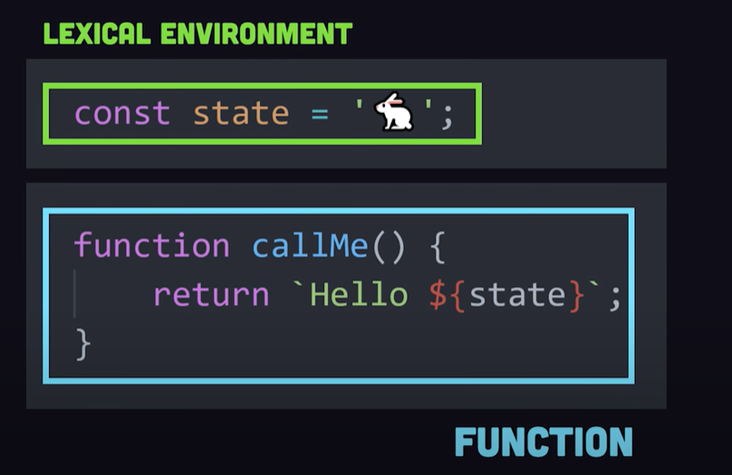

# Closures

## 1. Introduction

Closure is when you have a function defined inside of another function, that inner function has access to the variables and scope of the outer function even if the outer function finishes executing and those variables are no longer accessible outside of that function.



Closures from definition requires more memory and computation

Use closures for data encapsulation

The closure has three scope chains

Own scope where variables defined between its curly brackets Outer funcion's variables Global Variables

## 2. Example Code

```js
function Welcome(name) {
  var greetingInfo = function (message) {
    console.log(message + " " + name);
  };
  return greetingInfo;
}

var myFunction = Welcome("John");
myFunction("Welcome "); //Output: Welcome John
myFunction("Hello Mr."); //output: Hello Mr.John
```

As per the above code, the inner function greetingInfo has access to variables in outer function scope Welcome even though the outer function has returned.
