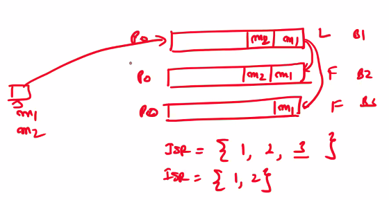
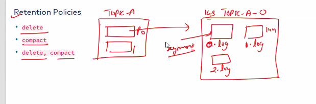
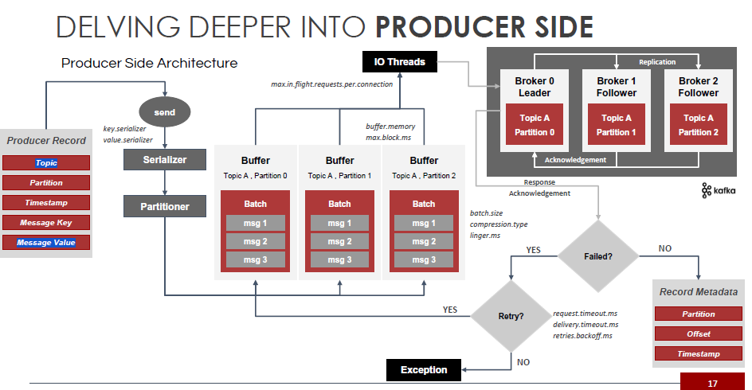
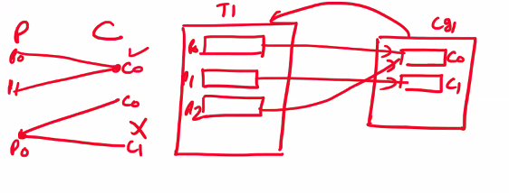
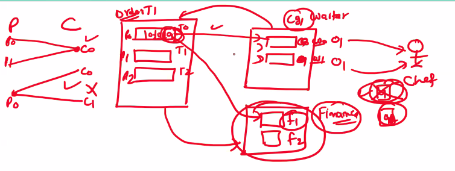
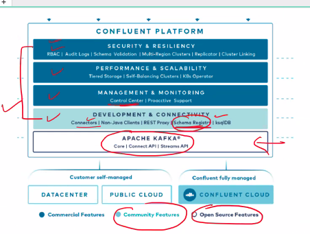
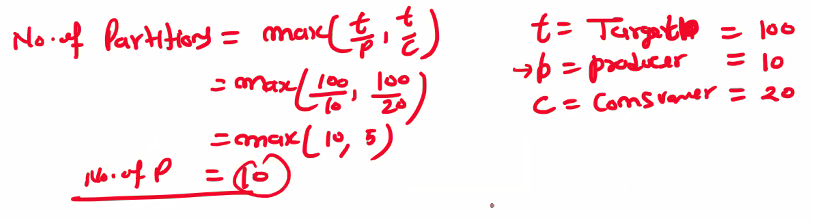
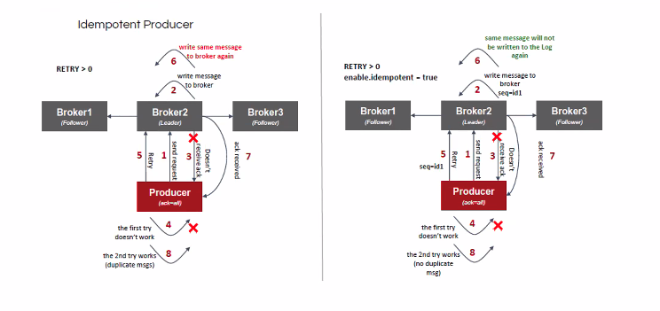

# Introduction

## Fundamentals Review

- Messages in a Kafka topic are not necessarily on the same broker. Kafka topics are divided into partitions, which are distributed across multiple brokers in a cluster. This distribution allows Kafka to scale horizontally and handle large volumes of data

- All messages in a Kafka partition are not necessarily on the same broker. While a partition's leader is on a single broker, Kafka uses replication to ensure fault tolerance and high availability

- All messages with the same key will not necessarily be on the same broker in Kafka. However, messages with the same key will be sent to the same partition. Here's a more detailed explanation

- Record (Messages) consists of `timestamp`, `key-value` and/or `metadata`

- Consumers initiate the reading of messages from Kafka topics, not the Kafka cluster itself. This pull-based model is a fundamental aspect of Kafka's design and operation

---

## First Module (Fundamentals)

- Kafka cluster with 3 brokers

  - 1 Broker is going to be a leader, elected by the zookeeper cluster
  - leader [controller] maintain metadata of the cluster
  - metadata will be preserved in zookeeper and other brokers also

- Bootstrap servers simplify the process of connecting to a Kafka cluster, allowing clients to interact with the entire system without needing detailed knowledge of its structure

- Replication Factor. Will have multiple partitions in different brokers to ensure no message loss, high availability and 100% fault tolerant

- How is message being sent from producer, sent to the correct partition? Leader - Follower Concept. Producer only WRITES to Leader PARTITION. Follower will run an algorithm to fetch the data and replicate the data accordingly.

  - Leader Partitions can be in various brokers [*]. Kafka does not intentionally place all leader partitions on the same broker. In fact, Kafka aims to distribute partition leaders evenly across brokers for load balancing and fault tolerance.
  - Leader Relection. Costly process.
  - ISR. In-Sync Replica
    
  - Unclean Leader Election. Can make a leader from remaining follower. Can be set by yourself to `true`

- Overview of Key Kafka Components

  - Broker (Computation / Storage)
  - Controller
  - Bootstrap Server (provides metadata)
  - Topics
  - Partitions
  - Replica Factor
  - Leader / Follower
  - ISR
  - Leader Elections
  - Producers / Consumers (These 2 are also known as kafka clients, which can be java programs or CLI tools)

- Bootstrap Server = "kafka1:9092,kafka2:9092,kafka3:9092" (good to just list all your available brokers)

- Retention Policies
  - delete
  - compact
  - delete,compact
  - Retention time by default is `7 days`

- Clean and Dirty Segments

- Active and Inactive Segments

  - 1GB or 7 Days
  - Messages are written to the `active` segment of logs

- Follower Fetching (slide 46)
- can fetch from nearer region but must be in ISR

---

## Second Module (Java Producers)

- Specifying a Producer Record

  - `Topic` and `message value` are mandatory

- Send --> Serializer --> Partioner

  - Producing, we serialize, Consuming, we deserialize

- To specify producer need to instantiate the following classes

  - `Properties`
  - `KafkaProducer`
  - `ProducerRecord`

- Use the helper class to prevent typo error related issues

  - `ProducerConfig.BOOTSTRAP_SERVERS_CONFIG`

- Can also use `.properties` file instead of using the code based approach

---

## Third Module (Preparing Producers for Practical use cases)

- batch multiple messages into a buffer to one shot flush into the broker
- Messages are stored in the buffer `per topic-partition`
- Factors to consider, throughput and latency

  - throughput [`batch.size`]: how many messages to send at once
  - latency [`linger.ms`]: maximum time a batch will wait to accumulate before sending.

- config `max.block.ms` to put a limit on how long a producer will wait for there to be space in the buffer before a send() fails

- How do producers know brokers received messages?

  - [acks] = 0, 1, -1 (all followers in sync already then acknowledge)

- what happens when message fails?
- best practice: limit delivery with timeouts, not number of retries

- When do we include keys when sending records in Kafka? [Scenario of presence of keys]

  - `partition index` = hash(key) % no of partitions [where the record is being placed, in which partition]
  - by hashing the keys, can make sure all the message with the same key goes to the same partition
  - Can make use of custom partitioner to define how to partition based on keys provided

- When we dont include keys [slide 52 of student handbook]
  - round robin order, message will be placed randomly

---

## Fourth Module (Consumers)

- consumer fetch requests configurations (settings)

  - fetch.min.bites
  - fetch.max.wait.ms
  - slide 117

- consumer requires deserializer

  - page 125
  - on producer end, we convert message to 0s and 1s (serialization), since message stored in kafka are serialized, when we receieve them on consumer end, we need to deserialize.

- polling and processing

  - consumers poll cluster for messages (i.e. fetch requests)

- `__consumer_offset` a topic maintained by kafka

  - maintain consumer group name, topic name and partition number as keys, offset as value
  - thats how kafka keeptrack of offsets and does not re-consume messages

- duplicate consumption should not happened and it is ensured by consumer group

## Fifth Module (Consumer in Practice)

- strategies in assigning consumer groups to topics with partitions

  - 1. round-robin strategy

    - consumers can get multiple partitions
    - BUT partitions cannot be subscribed by multiple consumers in the same consumer group
    - HOWEVER you can have 2 consumer groups consuming the same partition

    

    

  - 2. Range strategy

    - predefining which partition number is consumed by which consumer
    - both producer (partitioner) and consumer (range strategy) needs to be configured to ensure a certain order that you want.
    - TLDR: relate data across two or more co-partitioned topics

- consumers more than partitions, extra consumers will sit idle

- Rebalancing happens when (and its costly!!), consumption will also pause

  - add consumer
  - delete consumer
  - add partition

- how is consumer deemed "dead"

  - by polling (5mins)
  - by heartbeat (45s)
  - both must be fufilled to stay "alive"

- if there are multiple partitions and single consumer, the single consumer will consume from multiple partitions and kafka will try to minimise lag across all partitions

---

## Sixth Module (Schema and Schema Registry)

- Format with constraints --> Schema
- To use Schema registry, your record just has another field storing the schema id

  - To prevent overhead of fetching the schema from registry, maintain cache in producer

  

---

## Seventh Module (Kafka Streams)

- source topic and sink topic

- kafka stream follows the consume-process-produce model

- kafka stream is a separate application

  - a kafka client, working as a producer and consumer

- windowing capabilities

- Streams vs Tables

  - Streams: Working with events in time/history
  - Table: Storing status / state

- Combination
- Table + Stream = Stream
- Stream + Stream = Stream

---

## Eighth Module (ksqlDB)

- an alternative to using Kafka Streams API
- though it is less flexible
- by right easier compared to writing a Java Streams Application

---

## Ninth Module (Kafka Connect)

- Kafka Connect --> another Kafka Client
  - works as a producer and consumer
- Install and Configure connector
- Source and Sink Connectors

---

## Tenth Module (Advanced Kafka Development Matters)

---

## Eleventh Module (Partitioning Considerations)

- No.of Partitions = max (t/p, t/c)
  - where t = target throughput
  - p = producer throughput per partition
  - c consumer throughput per partition

- Kafka recommends not go go beyond 4000 partitions per broker and 200,000 partitions per cluster

- we try to keep num of consumers === num of producers

- range strategy (first partition goes to first consumer)

---

## Twelth Module (Message Considerations)

- How to deal with guranteeing ordered delivery of messages and non-duplicated writes?

  - `enable.idempotence=true`, `acks=all`
    - the `enable.idempotence=true` setting in the producer ensures messages are not duplicated, even in the case of producer retries or broker failure. This is possible due to headers in the message format for producer ID and sequence number

- Follower has default 30s to fetch and sync from Leader

Just a general question, would you recommend using kafka for a real time chat based application? If yes how would you maintain the various conversations, by kafka topics or using message keys?
